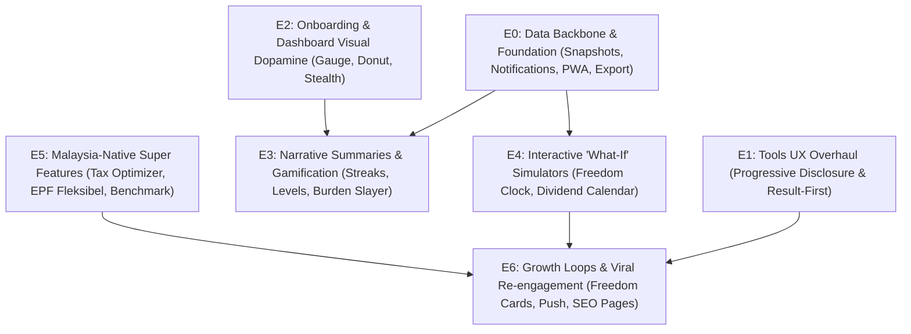

# OhMyMine — Implementation Plan V2 (Engagement & Retention Roadmap)

> **STATUS: ACTIVE / LOCKED SPEC.**  
> Supersedes `docs/Implementation_plan v2 after users feedback boring.docx`.  
> This roadmap addresses direct user feedback: the site feels like a **static/boring spreadsheet**, the calculators feel **messy**, and the core tools feel **too basic**.  
> This roadmap runs on its own sequenced track (`E0` through `E6`) to avoid overlapping with the completed Admin Backend phases (`Phase 1–7` in `docs/admin-backend-tasks.md`).

---

## Executive Summary: Transforming Ledger to Command Center

| Problem Identified | Root Cause | Solution in V2 |
|---|---|---|
| **"Site feels boring"** | Static numbers, text tables, no visual feedback or motion after initial data entry. | Animated Freedom Gauge, Asset/Burden Donut charts, number tickers, milestone celebrations, and Stealth/Cafe mode. |
| **"Calculators feel messy"** | Too many inputs shown at once without visual hierarchy. | Result-first layout: answer prominently displayed at top/side, secondary inputs tucked cleanly below. |
| **"Tools feel too basic"** | One-size-fits-all forms lack depth for experienced investors. | Progressive disclosure: simple inputs by default, opt-in "Advanced Options" (compounding, tax, multi-placement). |
| **"No reason to return"** | No historical tracking, no streaks, no proactive alerts. | Monthly net-wealth snapshots, check-in streaks, dynamic notification triggers, and the Freedom Clock simulator. |

---

## Phase Dependency & Sequence Map

---

## E0 — Foundation: Data Backbone & Loose Ends

> **Goal:** Build the essential historical data tables and fix broken/mocked primitives before layering gamification on top.  
> **Prerequisites:** None (builds on current EF Core & MasterData schema).  
> **Effort:** Medium

### Tasks

1. **Net Wealth Snapshot Table & Capture Service (`NetWealthSnapshot`)**
   - Create an EF entity and PostgreSQL table in `OMM.Public` to record historical user metrics:
     - `UserId` (FK to `AspNetUsers`)
     - `SnapshotDate` (Date/Timestamp)
     - `TotalMinesValue` (decimal)
     - `TotalBurdensBalance` (decimal)
     - `NetWealth` (decimal)
     - `FreedomRatio` (decimal)
     - `PassiveIncomeMonthly` (decimal)
     - `ActiveIncomeMonthly` (decimal)
   - Add a lightweight snapshot capture trigger: automatically record a snapshot when values change (throttled to at most once per day per user), plus a background weekly rollup.
   - *Why first:* Trendline charts, monthly check-in streaks, and the Freedom Clock all require historical data points.

2. **Real Notifications Engine**
   - Replace `MockMineService._notifications` with a real database-computed notification evaluator:
     - **FD Maturity Alert:** Triggers if an FD mine has a maturity date within 14 days.
     - **Milestone Alert:** Triggers when Freedom Ratio crosses 25%, 50%, 75%, 100%, or when net worth crosses round RM milestones.
     - **Stale Valuation Alert:** Triggers when an unlisted asset or manual stock hasn't been updated in >45 days.

3. **Working Data Export (`Settings.razor`)**
   - Implement actual JSON export logic for `ExportUserDataAsync()`.
   - Generates a timestamped JSON file containing all user mines, burdens, incomes, and goals, triggering a browser download.

4. **PWA Manifest & Icon Assets Verification**
   - Ensure `icon-192.png`, `icon-512.png`, and `icon-maskable-512.png` exist with correct MIME types in `OMM.Public/wwwroot/`.
   - Validate that "Add to Home Screen" on iOS and Android installs cleanly without broken icon placeholders.

### Acceptance Criteria
- [ ] `NetWealthSnapshots` table exists in PostgreSQL and logs snapshots upon mine/burden updates.
- [ ] Notifications dropdown renders computed alerts from real user data (zero hardcoded strings).
- [ ] Clicking "Export Data" in Settings downloads a clean `.json` export file.
- [ ] PWA manifest passes browser inspection with valid 192px and 512px icons.

---

## E1 — Tools UX Overhaul (Progressive Disclosure & Result-First)

> **Goal:** Eliminate calculator clutter ("messy") while adding power-user depth ("too basic") through progressive disclosure.  
> **Prerequisites:** None.  
> **Effort:** Medium-Large

### Tasks

1. **Progressive Disclosure Pattern across All 6 Calculators**
   - Present clean, simple forms by default (3–4 primary inputs).
   - Place advanced parameters behind an accordion toggle: `"Show Advanced Options"`.
   - Retain user preferences so returning users don't have to re-toggle.

2. **Advanced Tier Options for Core Tools**
   - **Fixed Deposit & Cash Yield:** Compounding frequencies (monthly, quarterly, annually, at maturity), early withdrawal penalty deduction, and multi-placement ladder modeling.
   - **Emergency Fund Planner:** Variable monthly expenses breakdown (essential vs discretionary) instead of a single flat sum, plus partial-income runway scenarios (e.g. 50% pay cut vs 0%).
   - **Debt Payoff Accelerator:** Multi-burden support to model paying off 2+ loans simultaneously.
   - **Stock Dividend Calculator:** Fractional DRIP modeling, configurable annual dividend growth rate, and withholding tax toggles (for foreign holdings).
   - **Compound Growth Simulator:** Variable monthly contribution increments and inflation adjustments.

3. **Result-First Layout Redesign**
   - Reorder layout hierarchy: display key outputs prominently at the top or sticky side (e.g. Total Return, Maturity Value, Freedom Boost) in large, bold typography with badge tags.
   - Sliders and input fields act as responsive "tuning knobs" underneath that update results instantly.

4. **Universal "Save as Mine / Goal" Flow**
   - Standardize the `SaveToMinesAsync` workflow across all tools:
     - Fixed Deposit Calculator $\rightarrow$ *"Save placement as Mine"*
     - Dividend Calculator $\rightarrow$ *"Save holding as Stock Mine"*
     - Emergency Fund Planner $\rightarrow$ *"Set as Safety Net Goal"* (saved to Goals)
     - Compound Growth Simulator $\rightarrow$ *"Save as Wealth Goal"* (saved to Goals)
     - Debt Accelerator $\rightarrow$ *"Update Burden Repayment Plan"*

5. **URL-Driven Pre-Fill & Shareable Links**
   - Support query parameters: e.g. `/tools/dividend?symbol=1155&shares=2000` or `/tools/fd?amount=20000&rate=3.85`.
   - Allows users to bookmark, share calculations, and pre-fill data seamlessly.

### Acceptance Criteria
- [ ] Every calculator presents advanced inputs behind a collapsible "Advanced Options" toggle.
- [ ] Every calculator features a "Result-First" hero header that updates reactively on input.
- [ ] All 6 tools feature an active "Save as Mine" or "Save as Goal" action with pre-filled fields.
- [ ] Query strings populate calculator input fields on direct URL visit.

---

## E2 — Onboarding & Dashboard Visual Dopamine

> **Goal:** Cure the "boring spreadsheet" impression within the first 10 seconds of opening the dashboard.  
> **Prerequisites:** Chart.js integration (already in `App.razor`).  
> **Effort:** Medium

### Tasks

1. **Guided Empty State & "Mine Your First Asset" Onboarding**
   - Replace blank empty-state cards for new users with a guided 3-step prompt:
     1. *"Add your EPF balance"* (pre-selects EPF category, institution KWSP).
     2. *"Add your primary savings/FD"* (pre-selects Cash/FD).
     3. *"Add your major burden"* (e.g. Car loan, PTPTN, Mortgage).
   - Prompts give immediate visual progress and momentum within the first 60 seconds.

2. **Sample / Demo Portfolio Preview Toggle**
   - Add a *"Try Demo Portfolio"* pill/switch on the Dashboard.
   - Allows new or prospective users to test-drive a fully populated Mine Board with charts, stocks, and burdens before committing their personal numbers.

3. **Freedom Speedometer Arc Gauge**
   - Replace the static text `Freedom Ratio: 22%` with an animated SVG/Chart.js radial arc gauge.
   - Highlight 4 clear psychological stages:
     - `0% – 25%`: **Survival Buffer** 🛡️
     - `25% – 50%`: **Runway Builder** 🛫
     - `50% – 75%`: **Coast FIRE / Semi-Retirement** ⛵
     - `100%+`: **Sovereign Freedom** 👑

4. **Asset & Burden Breakdown Donut Chart**
   - Embed an interactive Chart.js donut chart on the main Mine Board:
     - Outer ring: Asset distribution (EPF, Stocks, Cash, Real Estate, Gold).
     - Inner ring or comparative bar: Total Burdens vs Total Assets.
     - Interactive click: clicking a category segment filters the mine list below.

5. **Stealth / "Cafe" Privacy Mode**
   - Add a dedicated eye icon toggle (`ti-eye` / `ti-eye-off`) in the top navigation bar.
   - When enabled, masks all financial values app-wide (`RM ••••••` or blurred filter).
   - Persists state in `localStorage` for privacy when working in coffee shops, offices, or public transit.

6. **Animated Number Transitions & Skeleton Loaders**
   - Port the count-up number animation (`home-animations.js`) into dashboard metric cards so numbers roll smoothly when changing or loading.
   - Replace plain spinner wheels with branded shimmer/skeleton loading cards.

### Acceptance Criteria
- [ ] New accounts with 0 mines see an onboarding setup card with pre-filled suggestions.
- [ ] Dashboard features an animated radial Freedom Gauge with stage milestones.
- [ ] Dashboard displays an interactive Chart.js asset/burden breakdown donut.
- [ ] Stealth mode toggle instantly masks all currency values across every screen.
- [ ] Metric cards animate numeric values smoothly on render and update.

---

## E3 — Narrative Summaries & Gamification

> **Goal:** Give users a reason to return regularly by turning wealth tracking into a rewarding mining adventure.  
> **Prerequisites:** `E0` (NetWealthSnapshot data).  
> **Effort:** Medium

### Tasks

1. **"Your Month in Mining" Dynamic Narrative**
   - Generate an automated, natural-language monthly summary card at the top of the dashboard:
     > *"In August, your mines generated **RM 1,840** in passive yield. A RM 500 extra payment to your Car Loan shaved **18 days** off your debt burden. Your Freedom Ratio climbed from **21% to 23%**."*
   - Gives users instant human context instead of forcing them to analyze raw tables.

2. **Mining Levels & Milestone Badges**
   - Define achievable, rewarding mining ranks:
     - **Level 1 — Pannier:** Added first mine and first burden.
     - **Level 2 — Prospector:** Emergency fund covers 3 months of recurring burdens.
     - **Level 3 — Vein Striker:** Total Mines exceed Total Burdens (Positive Net Worth).
     - **Level 4 — Bedrock Builder:** 6 months emergency buffer secured + Freedom Ratio $\ge 25\%$.
     - **Level 5 — Gold Vein Tycoon:** Passive income exceeds RM 2,500/month.
     - **Level 6 — Mountain Sovereign:** 100% Freedom Ratio (Self-sustaining wealth).
   - Display current miner badge in sidebar profile card with a progress bar to next rank.

3. **Burden Slayer Demolition Feedback**
   - Treat debt reduction as "demolishing" burdens.
   - Whenever an extra payment is recorded against a loan, display a visual breakdown:
     - Interest savings calculated over the remaining loan term.
     - Time shaved off loan maturity: *"You just demolished 14 days off your debt sentence!"*

4. **Monthly Mining Streak & Check-in Nudge**
   - Track consecutive monthly updates (e.g. "🔥 5-Month Mining Streak").
   - Display a gentle end-of-month banner: *"Update your EPF and stock values for September to keep your streak alive."*

5. **Celebratory Micro-Animations**
   - Integrate lightweight canvas confetti when:
     - A user levels up or unlocks a milestone badge.
     - A burden is completely paid off (`CurrentBalance = 0`).
     - A goal reaches 100%.

### Acceptance Criteria
- [ ] Dashboard displays a dynamic "Month in Mining" narrative generated from snapshot deltas.
- [ ] User profile displays an earned Mining Rank badge based on real metrics.
- [ ] Logging an extra debt payment displays time/interest demolished.
- [ ] Reaching 100% on a goal or clearing a burden triggers celebratory confetti animation.

---

## E4 — Interactive "What-If" Simulators

> **Goal:** Move beyond backward-looking tracking into interactive future scenario modeling.  
> **Prerequisites:** `E0` (Snapshot data) & `E1` (Calculator refactoring).  
> **Effort:** Medium-Large

### Tasks

1. **Interactive "Freedom Clock" Simulator**
   - Displays a dynamic retirement projection:
     > *"At your current savings rate and yield, your passive income covers 100% of living expenses by **November 2037**."*
   - Includes an interactive slider: *"What if I invest an extra RM [X] / month?"*
   - As the user drags the slider, the Freedom Clock date dynamically moves forward in real time (e.g. from 2037 to 2033), delivering instant gratification.

2. **Bursa Malaysia 12-Month Dividend Payday Calendar / Heatmap**
   - Leverage existing KLSE stock lookup and dividend engine to generate a 12-month calendar grid.
   - Maps out expected payout months for all stocks held in user mines (e.g. Maybank in May/Nov, Sunway REIT in Feb/Aug, Tenaga in April/Oct).
   - Shows projected monthly passive cashflow spikes throughout the year.

3. **Snowball vs. Avalanche Debt Crusher**
   - Interactive multi-debt comparison tool:
     - **Snowball method:** Pay off smallest burden balance first for psychological wins.
     - **Avalanche method:** Pay off highest interest rate burden first for maximum interest savings.
   - Allows user to allocate an extra RM 200–500/month and visually compare timeline graphs and total interest saved between both strategies.

### Acceptance Criteria
- [ ] Freedom Clock recalculates projected independence date reactively as contribution slider moves.
- [ ] Dividend calendar displays a 12-month visual grid populated with the user's active Bursa stock holdings.
- [ ] Debt Crusher compares Snowball vs Avalanche payoff schedules side-by-side with total interest savings.

---

## E5 — Malaysia-Native "Super Features"

> **Goal:** Build hyper-localized features that generic US/global finance apps cannot replicate.  
> **Prerequisites:** Verified Malaysian statutory limits.  
> **Effort:** Medium

### Tasks

1. **LHDN Annual Tax Relief "Mine" Optimizer**
   - Interactive checklist covering Malaysian tax relief categories:
     - EPF voluntary / Life Insurance (up to RM 7,000)
     - Private Retirement Scheme (PRS) (up to RM 3,000)
     - Medical / Education Insurance (up to RM 3,000)
     - Lifestyle / Tech / Books / Gym (up to RM 2,500)
     - SSPN Education Savings (up to RM 8,000)
     - EV Charging Equipment (up to RM 2,500)
   - Computes unclaimed relief and estimates the user's actual tax refund cash injection based on their marginal income tax bracket.

2. **EPF Account 1, 2 & 3 (Fleksibel) Restructuring Simulator**
   - Models the financial impact of EPF's 3-account framework (75% Persaraan, 15% Sejahtera, 10% Fleksibel).
   - Allows users to simulate withdrawing from Account 3 vs. letting it compound at EPF's historical dividend rate (5.3% – 6.0%) over 5, 10, and 20 years.
   - Demonstrates the true compounding opportunity cost of early withdrawals.

3. **Anonymous Demographic Benchmarking ("How Do I Compare?")**
   - Opt-in, strictly anonymized comparison against verified Malaysian benchmark statistics (DOSM Household Income & EPF median savings by age band):
     - *"Your Net Wealth places you in the top 35% for Malaysians aged 28–35."*
     - *"Your EPF balance is on track with the top quartile for your age group."*
   - Visual gauge shows where user sits relative to national median and recommended basic retirement savings targets.

### Acceptance Criteria
- [ ] LHDN Tax Optimizer calculates unclaimed relief and estimated refund across all current statutory categories.
- [ ] EPF Fleksibel simulator displays compounding loss projection for Account 3 withdrawals.
- [ ] Demographic benchmark compares user wealth against age-band median with clear source citations.

---

## E6 — Growth Loops & Viral Re-engagement

> **Goal:** Create organic acquisition hooks and automated re-engagement triggers.  
> **Prerequisites:** `E1` (SEO URLs), `E2` (Visual assets), `E4` (Freedom metrics).  
> **Effort:** Medium-Large

### Tasks

1. **Shareable "Freedom Card" Generator**
   - Generate an elegant, downloadable Wrapped-style image card summarizing an anonymized milestone:
     - *"28% Financially Free · Level 3 Vein Striker · OhMyMine"*
     - High-contrast, brand-styled visual ready for Instagram Stories, LinkedIn, or WhatsApp.
     - Strips out raw RM amounts for privacy while showcasing progress percentages and mining rank.

2. **Automated Notification & Re-engagement Triggers**
   - Browser Web Push / Email alerts for key moments:
     - **FD Maturity Nudge:** 7 days before an FD rolls over.
     - **Bursa Dividend Payday:** Day before an expected dividend distribution.
     - **EPF Annual Dividend Announcement:** Seasonal prompt when KWSP declares annual rates (February/March) to log dividend credits.

3. **Per-Stock Public SEO Calculator Landing Pages**
   - Expose standalone, publicly indexable calculator routes for popular Bursa stocks:
     - e.g. `/tools/dividend/maybank-1155`, `/tools/dividend/public-bank-1295`, `/tools/dividend/sunway-reit-5176`.
   - Server-renders stock price, latest historical dividend yield, and interactive calculator pre-loaded with that stock.
   - Serves as high-intent organic search funnel converting visitors into OhMyMine users.

### Acceptance Criteria
- [ ] Freedom Card generator outputs a clean, high-resolution PNG image on demand.
- [ ] System triggers notifications for FD maturity and dividend dates.
- [ ] Public per-stock URLs render populated dividend calculators accessible without authentication.

---

## Master Implementation Sequence & Effort Matrix

| Phase | Title | Key Deliverables | Effort | Dependencies |
|:---:|---|---|:---:|---|
| **E0** | Foundation: Data Backbone & Loose Ends | Snapshot table, real notifications, working export, PWA icons | **Medium** | None |
| **E1** | Tools UX Overhaul | Progressive disclosure, result-first UI, Save-to-Mine, URL pre-fill | **Medium-Large** | None |
| **E2** | Onboarding & Dashboard Visual Dopamine | Freedom gauge, Donut chart, Stealth mode, Onboarding flow | **Medium** | E0 (light) |
| **E3** | Narrative Summaries & Gamification | Mining ranks, Month in Mining summary, Burden Slayer, Confetti | **Medium** | E0, E2 |
| **E4** | Interactive "What-If" Simulators | Freedom Clock slider, Bursa Dividend Calendar, Debt Crusher | **Large** | E0, E1 |
| **E5** | Malaysia-Native Super Features | LHDN Tax Optimizer, EPF Account 3 Simulator, Age Benchmarks | **Medium** | E1 |
| **E6** | Growth Loops & Viral Re-engagement | Shareable Freedom Cards, Web Push alerts, Stock SEO Pages | **Medium-Large** | E1, E4, E5 |

---

## Suggested Build Order for Execution

To balance **immediate user gratification** with **solid technical foundations**, execute in the following exact order:

1. **Sprint 1 (Fast Dopamine):** `E2.3` (Freedom Gauge) + `E2.4` (Donut Chart) + `E2.5` (Stealth Mode) + `E2.6` (Animated Tickers).  
   *Users will immediately see a vibrant, interactive dashboard instead of a static spreadsheet without waiting for schema migrations.*
2. **Sprint 2 (Data Backbone):** `E0.1` (Snapshot Table) + `E0.2` (Real Notifications) + `E0.3` (Export) + `E0.4` (PWA Icons).  
   *Establishes the historical logging required for all subsequent intelligence.*
3. **Sprint 3 (Tools Overhaul):** `E1.1`–`E1.5` (Progressive disclosure, Result-first layout, Universal Save as Mine/Goal).  
   *Fixes user complaints about calculators being messy and basic.*
4. **Sprint 4 (Gamification & Stories):** `E3.1` (Month in Mining narrative) + `E3.2` (Mining Levels) + `E3.3` (Burden Slayer).  
   *Gives existing users a rewarding reason to keep returning.*
5. **Sprint 5 (Interactive Future):** `E4.1` (Freedom Clock) + `E4.2` (Bursa Dividend Calendar) + `E4.3` (Debt Crusher).  
   *Delivers the most engaging simulator features.*
6. **Sprint 6 (Local Dominance & Growth):** `E5.1` (LHDN Tax Relief) + `E5.2` (EPF Fleksibel) + `E6.1` (Freedom Cards) + `E6.3` (Stock SEO pages).  
   *Drives viral sharing, local differentiation, and organic search traffic.*
