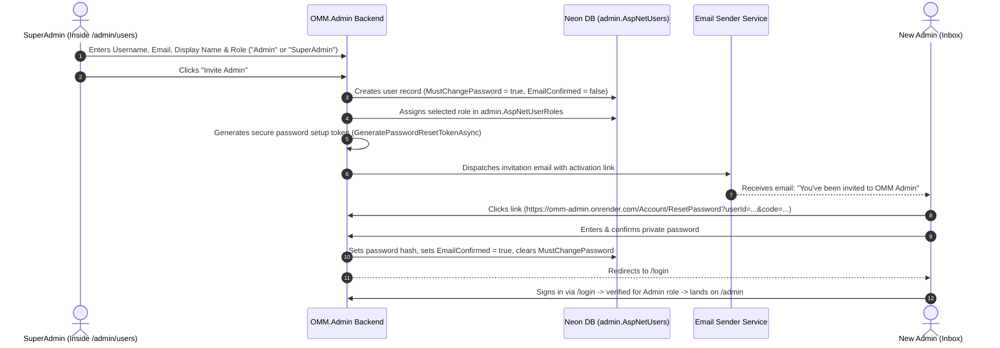

# Phase 7 — Admin User Management & Invitation Flow

> **Document Status:** Draft / Specification  
> **Target Audience:** Developer / Agent implementing the Admin User Management feature in `OMM.Admin`

---

## 1. Objective

Provide a secure, auditable, invitation-based user administration system at `/admin/users` in `OMM.Admin` restricted to `SuperAdmin` (and optionally `Admin` with view permissions).

Because public self-registration (`/Account/Register`) is permanently disabled on `OMM.Admin` for security, **all new admin accounts must be provisioned via an internal SuperAdmin invitation workflow**.

---

## 2. Core Architecture & Workflow

### 2.1 Invitation Sequence Diagram



---

## 3. Detailed Requirements

### 3.1 UI Surface (`/admin/users`)

- **Role Authorization:** Protected by `@attribute [Authorize(Policy = "RequireSuperAdminRole")]` or `@attribute [Authorize(Policy = "RequireAdminRole")]` (with edit actions restricted to SuperAdmins).
- **Listing Table:** Uses `AdminDataGrid<ApplicationUser>`:
  - Columns: `Username`, `Email`, `Role(s)`, `EmailConfirmed`, `MustChangePassword`, `LockoutEnd`, `CreatedAt`.
  - Action Slot:
    - "Resend Invite / Reset Link"
    - "Force Password Reset" (sets `MustChangePassword = true`)
    - "Lock / Unlock Account"
    - "Deactivate / Soft Delete"

### 3.2 "Invite Admin" Modal (`AdminInviteModal.razor`)

- **Fields:**
  - `Email` (Required, unique email check against `admin.AspNetUsers`)
  - `Username` (Required, unique)
  - `DisplayName` (Required)
  - `Role` (Dropdown: `Admin`, `SuperAdmin`)
- **Backend Execution:**
  ```csharp
  var user = new ApplicationUser
  {
      UserName = input.Username,
      Email = input.Email,
      DisplayName = input.DisplayName,
      MustChangePassword = true,
      EmailConfirmed = false
  };

  // Create with a random temporary cryptographically secure string (or no password)
  var result = await UserManager.CreateAsync(user);
  if (!result.Succeeded) { /* handle errors */ }

  await UserManager.AddToRoleAsync(user, input.Role);

  // Generate activation / set-password token
  var token = await UserManager.GeneratePasswordResetTokenAsync(user);
  var encodedToken = WebEncoders.Base64UrlEncode(Encoding.UTF8.GetBytes(token));

  var activationUrl = NavigationManager.GetUriWithQueryParameters(
      NavigationManager.ToAbsoluteUri("Account/ResetPassword").AbsoluteUri,
      new Dictionary<string, object?> { ["code"] = encodedToken, ["email"] = user.Email });

  // Send email
  await EmailSender.SendEmailAsync(user.Email, "You have been invited to OMM Admin", 
      $"Please set your password by <a href='{HtmlEncoder.Default.Encode(activationUrl)}'>clicking here</a>.");
  ```

---

## 4. Email Integration Requirement

- In Phase 7, integrate a real `IEmailSender<ApplicationUser>` implementation (e.g. via Resend, SendGrid, or AWS SES) replacing `IdentityNoOpEmailSender`.
- API keys stored in environment variables (`RESEND_API_KEY` or `SENDGRID_API_KEY`).

---

## 5. Security Gates & Auditing

1. **Self-Demotion / Lockout Guard:** A SuperAdmin cannot demote or lock out their own active session account.
2. **SuperAdmin Threshold:** At least one active SuperAdmin must always exist in the database.
3. **Invitation Expiration:** Token lifespan configured to 24 hours via `DataProtectionTokenProviderOptions.TokenLifespan`.
